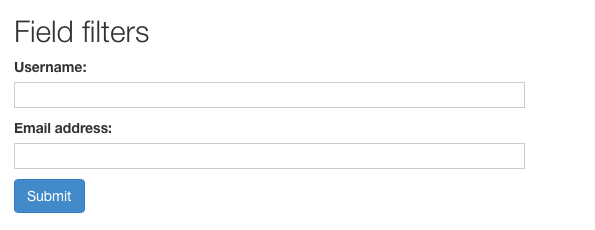

# Интеграция с DRF

Интеграция с [Django Rest Framework](http://www.django-rest-framework.org/) обеспечивается через специальный набор фильтров DRF **FilterSet** и [filter backend](http://www.django-rest-framework.org/api-guide/filtering/). Их можно найти в подпакете **rest\_framework**.

## Быстрый старт

Использование нового **FilterSet** просто требует изменения пути импорта. Вместо импорта из **django\_filters** импортируйте из подпакета **rest\_framework**.

```python
from django_filters import rest_framework as filters

class ProductFilter(filters.FilterSet):
    ...
```

Вашему классу представления также потребуется добавить **DjangoFilterBackend** в файл **filter\_backends**.

```python
from django_filters import rest_framework as filters

class ProductList(generics.ListAPIView):
    queryset = Product.objects.all()
    serializer_class = ProductSerializer
    filter_backends = (filters.DjangoFilterBackend,)
    filterset_fields = ('category', 'in_stock')
```

Если вы хотите использовать бэкэнд **django-filter** по умолчанию, добавьте его в параметр **DEFAULT\_FILTER\_BACKENDS**.

```python
# settings.py
INSTALLED_APPS = [
    ...
    'rest_framework',
    'django_filters',
]

REST_FRAMEWORK = {
    'DEFAULT_FILTER_BACKENDS': (
        'django_filters.rest_framework.DjangoFilterBackend',
        ...
    ),
}
```

## Добавление FilterSet с filterset\_class

Чтобы включить фильтрацию с помощью **FilterSet**, добавьте его в параметр **filterset\_class** класса представления.

```python
from rest_framework import generics
from django_filters import rest_framework as filters
from myapp import Product

class ProductFilter(filters.FilterSet):
    min_price = filters.NumberFilter(field_name="price", lookup_expr='gte')
    max_price = filters.NumberFilter(field_name="price", lookup_expr='lte')

    class Meta:
        model = Product
        fields = ['category', 'in_stock']

class ProductList(generics.ListAPIView):
    queryset = Product.objects.all()
    serializer_class = ProductSerializer
    filter_backends = (filters.DjangoFilterBackend,)
    filterset_class = ProductFilter
```

## Использование параметра filterset\_fields

Вы можете обойти создание **FilterSet**, добавив вместо этого **filterset\_fields** в свой класс представления. Это эквивалентно созданию **FilterSet** только с [Meta.fields](https://django-filter.readthedocs.io/en/main/ref/filterset.html#fields).

```python
from rest_framework import generics
from django_filters import rest_framework as filters
from myapp import Product

class ProductList(generics.ListAPIView):
    queryset = Product.objects.all()
    filter_backends = (filters.DjangoFilterBackend,)
    filterset_fields = ('category', 'in_stock')

# Эквивалентный FilterSet:
class ProductFilter(filters.FilterSet):
    class Meta:
        model = Product
        fields = ('category', 'in_stock')
```

Обратите внимание, что совместное использование полей **filterset\_fields** и **filterset\_class** не поддерживается.

## Переопределение создания FilterSet

Создание **FilterSet** можно настроить, переопределив следующие методы внутреннего класса:

* `.get_filterset(self, request, queryset, view)`
* `.get_filterset_class(self, view, queryset=None)`
* `.get_filterset_kwargs(self, request, queryset, view)`

Вы можете переопределять эти методы в каждом конкретном случае для каждого представления, создавая уникальные серверные части, или эти методы можно использовать для написания собственных хуков для класса представления.

```python
class MyFilterBackend(filters.DjangoFilterBackend):
    def get_filterset_kwargs(self, request, queryset, view):
        kwargs = super().get_filterset_kwargs(request, queryset, view)

        # объединить фильтры kwargs, предоставленные классом представления
        if hasattr(view, 'get_filterset_kwargs'):
            kwargs.update(view.get_filterset_kwargs())

        return kwargs

class BookFilter(filters.FilterSet):
    def __init__(self, *args, author=None, **kwargs):
        super().__init__(*args, **kwargs)
        # сделать что-нибудь с author

class BookViewSet(viewsets.ModelViewSet):
    filter_backends = [MyFilterBackend]
    filterset_class = BookFilter

    def get_filterset_kwargs(self):
        return {
            'author': self.get_author(),
        }
```

## Генерация схемы с помощью Core API и Open API

Бэкенд-класс интегрируется с генерацией схемы DRF путем реализации `get_schema_fields()` и `get_schema_operation_parameters().get_schema_fields()` включается автоматически при установке **Core API**. `get_schema_operation_parameters()` всегда включен для **Open API** (новое с DRF 3.9). Генерация схемы обычно работает без проблем, однако реализация ожидает вызова метода `get_queryset()` представления. Существует предостережение в том, что представления создаются искусственно во время генерации схемы, поэтому атрибуты **args** и **kwargs** будут пустыми. Если вы зависите от аргументов, проанализированных из URL-адреса, вам нужно будет обработать их отсутствие в `get_queryset()`.

Например, ваш метод получения набора запросов может выглядеть так:

```python
class IssueViewSet(views.ModelViewSet):
    queryset = models.Issue.objects.all()

    def get_project(self):
        return models.Project.objects.get(pk=self.kwargs['project_id'])

    def get_queryset(self):
        project = self.get_project()

        return self.queryset \
            .filter(project=project) \
            .filter(author=self.request.user)
```

Это можно было бы переписать так:

```python
class IssueViewSet(views.ModelViewSet):
    queryset = models.Issue.objects.all()

    def get_project(self):
        try:
            return models.Project.objects.get(pk=self.kwargs['project_id'])
        except models.Project.DoesNotExist:
            return None

    def get_queryset(self):
        project = self.get_project()

        if project is None:
            return self.queryset.none()

        return self.queryset \
            .filter(project=project) \
            .filter(author=self.request.user)
```

Или проще как:

```python
class IssueViewSet(views.ModelViewSet):
    queryset = models.Issue.objects.all()

    def get_queryset(self):
        # project_id может быть None
        return self.queryset \
            .filter(project_id=self.kwargs.get('project_id')) \
            .filter(author=self.request.user)
```

## Формы crispy-forms

Если вы используете API-интерфейс DRF для просмотра или API-интерфейс администратора, вы также можете установить **django-crispy-forms**, который улучшит представление форм фильтра в представлениях HTML, позволяя им отображать Bootstrap 3 HTML. Обратите внимание, что это не поддерживается активно, хотя запросы на исправление ошибок приветствуются.

```bash
pip install django-crispy-forms
```

Когда crispy-forms установлены и добавлены в **INSTALLED\_APPS** Django, доступный для просмотра API будет представлять элемент управления фильтрацией для **DjangoFilterBackend**, например так:

<figure><figcaption></figcaption></figure>

## Дополнительные функции набора фильтров FilterSet

Следующие функции характерны для остальных фреймворков **FilterSet**:

* **BooleanFilter** использует удобный для API виджет **BooleanWidget**, который принимает строчные `true/false`.
* Генерация фильтра использует **IsoDateTimeFilter** для полей модели даты и времени.
* Поднятые ошибки **ValidationError** повторно вызываются как их эквиваленты DRF.
