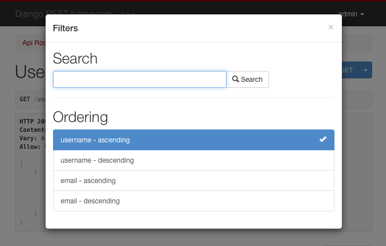

# Фильтрация

## Фильтрация обычными способами

> Корневой набор запросов, предоставляемый менеджером, описывает все объекты в таблице базы данных. Однако обычно вам нужно выбрать только часть полного набора объектов.
>
> * [Django documentation](https://docs.djangoproject.com/en/stable/topics/db/queries/#retrieving-specific-objects-with-filters)

Стандартное поведение универсальных представлений списков REST framework — возвращать весь набор запросов для диспетчера моделей. Часто вам понадобится, чтобы ваш API ограничивал элементы, возвращаемые набором запросов.

Самый простой способ отфильтровать набор запросов любого представления, являющегося подклассом **GenericAPIView**, — переопределить метод `.get_queryset()`.

Переопределение этого метода позволяет настроить набор запросов, возвращаемый представлением, различными способами.

### Фильтрация по текущему пользователю

Возможно, вы захотите отфильтровать набор запросов, чтобы гарантировать, что возвращаются только результаты, относящиеся к текущему аутентифицированному пользователю, выполняющему запрос.

Вы можете сделать это путем фильтрации на основе значения **request.user**.

Например:

```python
from myapp.models import Purchase
from myapp.serializers import PurchaseSerializer
from rest_framework import generics

class PurchaseList(generics.ListAPIView):
    serializer_class = PurchaseSerializer

    def get_queryset(self):
        """
        Это представление должно возвращать список всех покупок
        для текущего аутентифицированного пользователя.
        """
        user = self.request.user
        return Purchase.objects.filter(purchaser=user)
```

### Фильтрация по URL

Другой стиль фильтрации может включать ограничение набора запросов на основе некоторой части URL-адреса.

Например, если ваша конфигурация URL содержит такую запись:

```python
re_path('^purchases/(?P<username>.+)/$', PurchaseList.as_view()),
```

Затем вы можете написать представление, которое возвращает набор запросов на покупку, отфильтрованный по части имени пользователя в URL-адресе:

```python
class PurchaseList(generics.ListAPIView):
    serializer_class = PurchaseSerializer

    def get_queryset(self):
        """
        Это представление должно возвращать список всех покупок для пользователя,
        как определено частью имени пользователя в URL-адресе.
        """
        username = self.kwargs['username']
        return Purchase.objects.filter(purchaser__username=username)
```

### Фильтрация по параметрам запроса

Последним примером фильтрации исходного набора запросов может быть определение исходного набора запросов на основе параметров запроса в URL-адресе.

Мы можем переопределить `.get_queryset()` для работы с URL-адресами, такими как `http://example.com/api/purchases?username=denvercoder9`, и фильтровать набор запросов, только если параметр имени **username** включен в URL-адрес:

```python
class PurchaseList(generics.ListAPIView):
    serializer_class = PurchaseSerializer

    def get_queryset(self):
        """
        При необходимости ограничивает возвращенные покупки для данного пользователя
        путем фильтрации по параметру запроса `username` в URL-адресе.
        """
        queryset = Purchase.objects.all()
        username = self.request.query_params.get('username')
        if username is not None:
            queryset = queryset.filter(purchaser__username=username)
        return queryset
```

## Общая фильтрация

Помимо возможности переопределить набор запросов по умолчанию, среда REST также включает поддержку общих механизмов фильтрации, которые позволяют легко создавать сложные поиски и фильтры.

Общие фильтры также могут представлять собой элементы управления HTML в просматриваемом API и API администратора.

<figure><figcaption></figcaption></figure>

### Настройка внутренних фильтров

Серверные части фильтра по умолчанию могут быть установлены глобально с помощью параметра **DEFAULT\_FILTER\_BACKENDS**. Например:

```python
REST_FRAMEWORK = {
    'DEFAULT_FILTER_BACKENDS': ['django_filters.rest_framework.DjangoFilterBackend']
}
```

Вы также можете установить серверные части фильтра для каждого представления или для каждого набора представлений, используя представления на основе классов **GenericAPIView**.

```python
import django_filters.rest_framework
from django.contrib.auth.models import User
from myapp.serializers import UserSerializer
from rest_framework import generics

class UserListView(generics.ListAPIView):
    queryset = User.objects.all()
    serializer_class = UserSerializer
    filter_backends = [django_filters.rest_framework.DjangoFilterBackend]
```

### Фильтрация и поиск объектов

Обратите внимание, что если серверная часть фильтра настроена для представления, то она будет использоваться не только для фильтрации представлений списка, но и для фильтрации наборов запросов, используемых для возврата одного объекта.

Например, для предыдущего примера и продукта с идентификатором 4675 следующий URL-адрес либо вернет соответствующий объект, либо вернет ответ 404, в зависимости от того, были ли выполнены условия фильтрации для данного экземпляра продукта:

```http
http://example.com/api/products/4675/?category=clothing&max_price=10.00
```

### Переопределение исходного набора запросов

Обратите внимание, что вы можете использовать как переопределенный `.get_queryset()`, так и общую фильтрацию вместе, и все будет работать так, как ожидалось. Например, если **Product** имеет отношения многие ко многим с пользователем **User**, называемыми (отношениями) **purchase**, вы можете написать такое представление:

```python
class PurchasedProductsList(generics.ListAPIView):
    """
    Возвращает список всех продуктов, которые когда-либо покупал
    аутентифицированный пользователь, с дополнительной фильтрацией.
    """
    model = Product
    serializer_class = ProductSerializer
    filterset_class = ProductFilter

    def get_queryset(self):
        user = self.request.user
        return user.purchase_set.all()
```

## Руководство API
