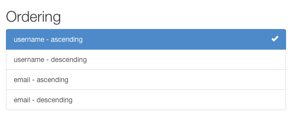

# Фильтрация

## Фильтрация обычными способами

> Корневой набор запросов, предоставляемый менеджером, описывает все объекты в таблице базы данных. Однако обычно вам нужно выбрать только часть полного набора объектов.
>
> * [Django documentation](https://docs.djangoproject.com/en/stable/topics/db/queries/#retrieving-specific-objects-with-filters)

Стандартное поведение универсальных представлений списков REST framework — возвращать весь набор запросов для диспетчера моделей. Часто вам понадобится, чтобы ваш API ограничивал элементы, возвращаемые набором запросов.

Самый простой способ отфильтровать набор запросов любого представления, являющегося подклассом **GenericAPIView**, — переопределить метод `.get_queryset()`.

Переопределение этого метода позволяет настроить набор запросов, возвращаемый представлением, различными способами.

### Фильтрация по текущему пользователю

Возможно, вы захотите отфильтровать набор запросов, чтобы гарантировать, что возвращаются только результаты, относящиеся к текущему аутентифицированному пользователю, выполняющему запрос.

Вы можете сделать это путем фильтрации на основе значения **request.user**.

Например:

```python
from myapp.models import Purchase
from myapp.serializers import PurchaseSerializer
from rest_framework import generics

class PurchaseList(generics.ListAPIView):
    serializer_class = PurchaseSerializer

    def get_queryset(self):
        """
        Это представление должно возвращать список всех покупок
        для текущего аутентифицированного пользователя.
        """
        user = self.request.user
        return Purchase.objects.filter(purchaser=user)
```

### Фильтрация по URL

Другой стиль фильтрации может включать ограничение набора запросов на основе некоторой части URL-адреса.

Например, если ваша конфигурация URL содержит такую запись:

```python
re_path('^purchases/(?P<username>.+)/$', PurchaseList.as_view()),
```

Затем вы можете написать представление, которое возвращает набор запросов на покупку, отфильтрованный по части имени пользователя в URL-адресе:

```python
class PurchaseList(generics.ListAPIView):
    serializer_class = PurchaseSerializer

    def get_queryset(self):
        """
        Это представление должно возвращать список всех покупок для пользователя,
        как определено частью имени пользователя в URL-адресе.
        """
        username = self.kwargs['username']
        return Purchase.objects.filter(purchaser__username=username)
```

### Фильтрация по параметрам запроса

Последним примером фильтрации исходного набора запросов может быть определение исходного набора запросов на основе параметров запроса в URL-адресе.

Мы можем переопределить `.get_queryset()` для работы с URL-адресами, такими как `http://example.com/api/purchases?username=denvercoder9`, и фильтровать набор запросов, только если параметр имени **username** включен в URL-адрес:

```python
class PurchaseList(generics.ListAPIView):
    serializer_class = PurchaseSerializer

    def get_queryset(self):
        """
        При необходимости ограничивает возвращенные покупки для данного пользователя
        путем фильтрации по параметру запроса `username` в URL-адресе.
        """
        queryset = Purchase.objects.all()
        username = self.request.query_params.get('username')
        if username is not None:
            queryset = queryset.filter(purchaser__username=username)
        return queryset
```

## Общая фильтрация

Помимо возможности переопределить набор запросов по умолчанию, среда REST также включает поддержку общих механизмов фильтрации, которые позволяют легко создавать сложные поиски и фильтры.

Общие фильтры также могут представлять собой элементы управления HTML в просматриваемом API и API администратора.

<figure><figcaption></figcaption></figure>

### Настройка внутренних фильтров

Серверные части фильтра по умолчанию могут быть установлены глобально с помощью параметра **DEFAULT\_FILTER\_BACKENDS**. Например:

```python
REST_FRAMEWORK = {
    'DEFAULT_FILTER_BACKENDS': ['django_filters.rest_framework.DjangoFilterBackend']
}
```

Вы также можете установить серверные части фильтра для каждого представления или для каждого набора представлений, используя представления на основе классов **GenericAPIView**.

```python
import django_filters.rest_framework
from django.contrib.auth.models import User
from myapp.serializers import UserSerializer
from rest_framework import generics

class UserListView(generics.ListAPIView):
    queryset = User.objects.all()
    serializer_class = UserSerializer
    filter_backends = [django_filters.rest_framework.DjangoFilterBackend]
```

### Фильтрация и поиск объектов

Обратите внимание, что если серверная часть фильтра настроена для представления, то она будет использоваться не только для фильтрации представлений списка, но и для фильтрации наборов запросов, используемых для возврата одного объекта.

Например, для предыдущего примера и продукта с идентификатором 4675 следующий URL-адрес либо вернет соответствующий объект, либо вернет ответ 404, в зависимости от того, были ли выполнены условия фильтрации для данного экземпляра продукта:

```http
http://example.com/api/products/4675/?category=clothing&max_price=10.00
```

### Переопределение исходного набора запросов

Обратите внимание, что вы можете использовать как переопределенный `.get_queryset()`, так и общую фильтрацию вместе, и все будет работать так, как ожидалось. Например, если **Product** имеет отношения многие ко многим с пользователем **User**, называемыми (отношениями) **purchase**, вы можете написать такое представление:

```python
class PurchasedProductsList(generics.ListAPIView):
    """
    Возвращает список всех продуктов, которые когда-либо покупал
    аутентифицированный пользователь, с дополнительной фильтрацией.
    """
    model = Product
    serializer_class = ProductSerializer
    filterset_class = ProductFilter

    def get_queryset(self):
        user = self.request.user
        return user.purchase_set.all()
```

## Руководство API

### DjangoFilterBackend

Библиотека **django-filter** включает класс **DjangoFilterBackend**, который поддерживает фильтрацию полей с широкими возможностями настройки для среды **REST**.

Чтобы использовать **DjangoFilterBackend**, сначала установите **django-filter**.

```bash
pip install django-filter
```

Затем добавьте `'django_filters'` в **INSTALLED\_APPS** Django:

```python
INSTALLED_APPS = [
    ...
    'django_filters',
    ...
]
```

Теперь вы должны либо добавить бэкэнд фильтра в свои настройки:

```python
REST_FRAMEWORK = {
    'DEFAULT_FILTER_BACKENDS': ['django_filters.rest_framework.DjangoFilterBackend']
}
```

Или добавьте серверную часть фильтра к отдельному представлению или набору представлений.

```python
from django_filters.rest_framework import DjangoFilterBackend

class UserListView(generics.ListAPIView):
    ...
    filter_backends = [DjangoFilterBackend]
```

Если все, что вам нужно, это простая фильтрация на основе равенства, вы можете установить атрибут **filterset\_fields** в представлении или наборе представлений, указав набор полей, по которым вы хотите фильтровать.

```python
class ProductList(generics.ListAPIView):
    queryset = Product.objects.all()
    serializer_class = ProductSerializer
    filter_backends = [DjangoFilterBackend]
    filterset_fields = ['category', 'in_stock']
```

Это автоматически создаст класс **FilterSet** для заданных полей и позволит вам делать такие запросы, как:

```http
http://example.com/api/products?category=clothing&in_stock=True
```

Для более сложных требований фильтрации вы можете указать класс **FilterSet**, который должен использоваться представлением. Вы можете прочитать больше о **FilterSet** в [документации по django-filter](https://django-filter.readthedocs.io/en/latest/index.html). Также рекомендуется прочитать раздел об [интеграции DRF](https://django-filter.readthedocs.io/en/latest/guide/rest\_framework.html).

### SearchFilter

Класс **SearchFilter** поддерживает простой поиск на основе одного параметра запроса и основан на [функциональности поиска администратора Django](https://docs.djangoproject.com/en/stable/ref/contrib/admin/#django.contrib.admin.ModelAdmin.search\_fields).

При использовании доступный для просмотра API будет включать элемент управления **SearchFilter**:

<figure><figcaption></figcaption></figure>

Класс **SearchFilter** будет применяться только в том случае, если для представления установлен атрибут **search\_fields**. Атрибут **search\_fields** должен быть списком имен полей текстового типа в модели, например **CharField** или **TextField**.

```python
from rest_framework import filters

class UserListView(generics.ListAPIView):
    queryset = User.objects.all()
    serializer_class = UserSerializer
    filter_backends = [filters.SearchFilter]
    search_fields = ['username', 'email']
```

Это позволит клиенту фильтровать элементы в списке, выполняя такие запросы, как:

```http
http://example.com/api/users?search=russell
```

Вы также можете выполнить связанный поиск для **ForeignKey** или **ManyToManyField** с нотацией двойного подчеркивания API поиска:

```python
search_fields = ['username', 'email', 'profile__profession']
```

Для полей [JSONField](https://docs.djangoproject.com/en/3.0/ref/contrib/postgres/fields/#jsonfield) и [HStoreField](https://docs.djangoproject.com/en/3.0/ref/contrib/postgres/fields/#hstorefield) вы можете фильтровать на основе вложенных значений в структуре данных, используя ту же нотацию с двойным подчеркиванием:

```python
search_fields = ['data__breed', 'data__owner__other_pets__0__name']
```

По умолчанию при поиске будут использоваться частичные совпадения без учета регистра. Параметр поиска может содержать несколько условий поиска, которые должны быть разделены пробелами и/или запятыми. Если используется несколько условий поиска, объекты будут возвращены в список только в том случае, если все предоставленные условия совпадают.

Поведение при поиске может быть ограничено добавлением различных символов перед **search\_fields**.

* `'^'` - с начала строки
* `'='` - точное совпадение
* `'@'` - полнотекстовый поиск (в настоящее время поддерживается только [Django PostgreSQL backend](https://docs.djangoproject.com/en/stable/ref/contrib/postgres/search/))
* `'$'` - поиск регулярных выражений

Например:

```python
search_fields = ['=username', '=email']
```

По умолчанию параметр поиска называется `'search'`, но его можно переопределить настройкой **SEARCH\_PARAM**.

Чтобы динамически изменять поля поиска на основе содержимого запроса, можно создать подкласс **SearchFilter** и переопределить функцию `get_search_fields()`. Например, следующий подкласс будет искать только по заголовку **title**, если в запросе есть параметр **title\_only**:

```python
from rest_framework import filters

class CustomSearchFilter(filters.SearchFilter):
    def get_search_fields(self, view, request):
        if request.query_params.get('title_only'):
            return ['title']
        return super().get_search_fields(view, request)
```

Дополнительные сведения см. в [документации Django](https://docs.djangoproject.com/en/stable/ref/contrib/admin/#django.contrib.admin.ModelAdmin.search\_fields).

### OrderingFilter

Класс **OrderingFilter** поддерживает простое упорядочивание результатов, контролируемое параметром запроса.

<figure><figcaption></figcaption></figure>

По умолчанию параметр запроса называется `'ordering'`, но его можно переопределить настройкой **ORDERING\_PARAM**.

Например, чтобы упорядочить пользователей по имени пользователя **username**:

```http
http://example.com/api/users?ordering=username
```

Клиент также может указать обратный порядок, поставив перед именем поля префикс `'-'`, например:

```http
http://example.com/api/users?ordering=-username
```

Также может быть указано несколько параметров сортировки:

```http
http://example.com/api/users?ordering=account,username
```

### Указание того, какие поля можно упорядочить

Рекомендуется явно указать, какие поля API должен разрешить в фильтре упорядочивания. Вы можете сделать это, установив атрибут **ordering\_fields** в представлении, например:

```python
class UserListView(generics.ListAPIView):
    queryset = User.objects.all()
    serializer_class = UserSerializer
    filter_backends = [filters.OrderingFilter]
    ordering_fields = ['username', 'email']
```

Это помогает предотвратить непредвиденную утечку данных, например, позволяя пользователям размещать заказы по хэш-полю пароля или другим конфиденциальным данным.

Если вы не укажете атрибут **ordering\_fields** в представлении, класс фильтра по умолчанию позволит пользователю фильтровать любые читаемые поля в сериализаторе, указанном атрибутом **serializer\_class**.

Если вы уверены, что набор запросов, используемый представлением, не содержит конфиденциальных данных, вы также можете явно указать, что представление должно разрешать упорядочение любого поля модели или агрегата набора запросов, используя специальное значение `"__all__"`.

```python
class BookingsListView(generics.ListAPIView):
    queryset = Booking.objects.all()
    serializer_class = BookingSerializer
    filter_backends = [filters.OrderingFilter]
    ordering_fields = '__all__'
```

### Указание порядка по умолчанию

Если в представлении установлен атрибут **ordering**, он будет использоваться как порядок по умолчанию.

Обычно вы вместо этого управляете этим, устанавливая **order\_by** в начальном наборе запросов, но использование параметра **ordering** в представлении позволяет вам указать порядок таким образом, чтобы его можно было затем автоматически передать в качестве контекста отображаемому шаблону. Это позволяет автоматически отображать заголовки столбцов по-разному, если они используются для упорядочивания результатов.

```python
class UserListView(generics.ListAPIView):
    queryset = User.objects.all()
    serializer_class = UserSerializer
    filter_backends = [filters.OrderingFilter]
    ordering_fields = ['username', 'email']
    ordering = ['username']
```

Атрибут **ordering** может быть либо строкой, либо списком/кортежем строк.

## Пользовательская общая фильтрация

Вы также можете предоставить свой собственный универсальный сервер фильтрации или написать устанавливаемое приложение **app** для использования другими разработчиками.

Для этого переопределите **BaseFilterBackend** и переопределите метод `.filter_queryset(self, request, queryset, view)`. Метод должен возвращать новый отфильтрованный набор запросов.

Помимо того, что клиенты могут выполнять поиск и фильтрацию, универсальные серверные части фильтров могут быть полезны для ограничения того, какие объекты должны быть видны для любого заданного запроса или пользователя.

### Пример

Например, может потребоваться разрешить пользователям видеть только созданные ими объекты.

```python
class IsOwnerFilterBackend(filters.BaseFilterBackend):
    """
    Фильтр, который позволяет пользователям видеть только свои собственные объекты.
    """
    def filter_queryset(self, request, queryset, view):
        return queryset.filter(owner=request.user)
```

Мы могли бы добиться такого же поведения, переопределив `get_queryset()` для представлений, но использование серверной части фильтра позволяет вам более легко добавить это ограничение к нескольким представлениям или применить его ко всему API.

### Настройка интерфейса

Общие фильтры также могут представлять интерфейс в доступном для просмотра API. Для этого вы должны реализовать метод `to_html()`, который возвращает отрисованное HTML-представление фильтра. Этот метод должен иметь следующую подпись:

`to_html(self, request, queryset, view)`

Метод должен возвращать отображаемую строку **HTML**.

### Фильтрация и схемы

Вы также можете сделать элементы управления фильтрами доступными для автоматической генерации схемы, предоставляемой инфраструктурой **REST**, путем реализации метода `get_schema_fields()`. Этот метод должен иметь следующую подпись:

`get_schema_fields (self, view)`

Метод должен возвращать список экземпляров `coreapi.Field`.

## Сторонние пакеты

Следующие сторонние пакеты предоставляют дополнительные реализации фильтров.

### Пакет фильтров Django REST framework

Пакет [django-rest-framework-filters](https://github.com/philipn/django-rest-framework-filters) работает вместе с классом **DjangoFilterBackend** и позволяет легко создавать фильтры для _**отношений**_ или создавать несколько типов поиска фильтров для заданного поля.

### Django REST framework фильтр поиска по полному слову

Библиотека [djangorestframework-word-filter](https://github.com/trollknurr/django-rest-framework-word-search-filter) разработана как альтернатива `filter.SearchFilter`, который будет искать полное слово в тексте или точное совпадение.

### URL-фильтр Django

[django-url-filter](https://github.com/miki725/django-url-filter) обеспечивает безопасный способ фильтрации данных с помощью удобных для человека URL-адресов. Он работает очень похоже на сериализаторы и поля DRF в том смысле, что они могут быть вложены, за исключением того, что они называются наборами фильтров и фильтрами. Это обеспечивает простой способ фильтрации связанных данных. Также эта библиотека является универсальной, поэтому ее можно использовать для фильтрации других источников данных, а не только Django **QuerySet**.

### drf-url-filters

[drf-url-filter](https://github.com/manjitkumar/drf-url-filters) — это простое приложение Django для применения фильтров к набору запросов drf **ModelViewSet** чистым, простым и настраиваемым способом. Он также поддерживает проверки параметров входящего запроса и их значений. Красивый пакет Python **Voluptuous** используется для проверки параметров входящего запроса. Лучшая часть **voluptuous** заключается в том, что вы можете определить свои собственные проверки в соответствии с требованиями к параметрам запроса.
