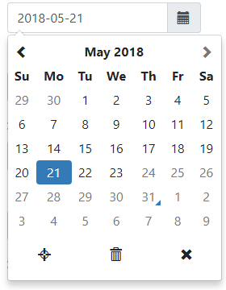
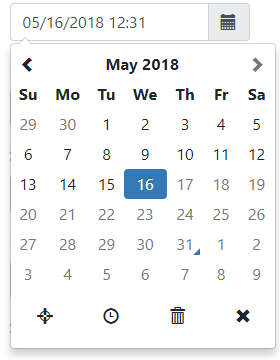
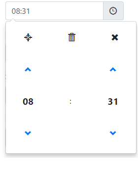

# django-bootstrap-datepicker-plus

Этот виджет django содержит Bootstrap 3, Bootstrap 4 и Bootstrap 5 **Date-Picker**, **Time-Picker**, **DateTime-Picker**, **Month-Picker** и **Year-Picker** с функцией выбора диапазона дат для версии django >= 2.0. Виджет реализует [bootstrap-datetimepicker v4](https://getdatepicker.com/4/) для отображения **bootstrap-datepicker** в формах моделей django и пользовательских формах, которые можно легко настроить для выбора диапазона дат.

Если вы не используете Bootstrap, используйте вместо него [django-flatpickr](https://github.com/monim67/django-flatpickr).

<figure><figcaption></figcaption></figure>

<figure><figcaption></figcaption></figure>

<figure><figcaption></figcaption></figure>

## Демо

* [С бутстрапом 3](https://monim67.github.io/django-bootstrap-datepicker-plus/demo/bootstrap3/)
* [С бутстрапом 4](https://monim67.github.io/django-bootstrap-datepicker-plus/demo/bootstrap4/)
* [С бутстрапом 5](https://monim67.github.io/django-bootstrap-datepicker-plus/demo/bootstrap5/)

## Содержание:

* [Приступаем к работе](pristupaem-k-rabote.md)
  * Требования
  * Установка
  * Настройка шаблона
* [Краткое руководство по прохождению](kratkoe-rukovodstvo.md)
  * CreateView для модели Question
  * UpdateView для модели Question
* [Использование](ispolzovanie.md)
  * Использование в общем представлении GenericView
  * Использование пользовательской формы
  * Использование формы модели
  * Типы DatePickers
  * Реализация выбора диапазона дат date-range-picker
* [Настройка](nastroika.md)
  * Настроить все входы
  * Настроить один вход
* [Настройка шаблона](nastroika-shablona.md)
* [Поиск ошибок](poisk-oshibok.md)
  * Ошибки, отображаемые на экране браузера
  * Ошибки, отображаемые в консоли браузера
  * Исправление ошибки 404 (не найдено)
  * Ошибок нигде нет, но календарь не отображается!
  * Моя ошибка здесь не указана
