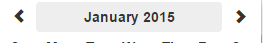

# Bootstrap 3 Datepicker v4 (options)


Важный! Пожалуйста, прочтите этот [пост в блоге](https://jonathanpeterson.com/posts/state-of-my-picker)


## Параметры


Доступ ко всем параметрам осуществляется через атрибут данных, например.\
`$('#datetimepicker').data("DateTimePicker").OPTION()`


### options()

Возвращает объект текущих параметров компонентов. Обратите внимание, что изменение значений возвращаемого объекта не меняет фактическую конфигурацию компонентов. Используйте `options(options)` для массовой установки параметров компонентов или другие методы для индивидуальной настройки параметров конфигурации.

### options(\[options])

Принимает объектную переменную со свойствами параметра `key:value` и настраивает компонент. Используйте это, чтобы обновить несколько параметров компонента.

### date

Возвращает текущую дату модели компонента, объект **moment** или значение **null**, если оно не установлено.

#### date(\[newDate])

Принимает **string, Date, moment, null** параметр и устанавливает для него текущий момент модели компонентов. Передача нулевого значения **null** отменяет текущий момент модели компонентов. Парсинг параметра **newDate** производится с помощью библиотеки **moment** с конфигурацией компонентов `options.format` и `options.useStrict`.

Вызывает:

* **TypeError** - в случае, если **newDate** не может быть проанализирован

Возвращает:

* **dp.change** - Если **newDate** отличается от текущего момента

### format

По умолчанию: **false**

См. [документацию momentjs](http://momentjs.com/docs/#/displaying/format/) для допустимых форматов. Формат также определяет, какие компоненты отображаются, например, MM/dd/YYYY не будет отображать окно выбора времени.

#### format()

Возвращает строку **options.format** компонента

#### format(format)

Принимает строку формата [moment.js](http://momentjs.com/docs/#/displaying/format/) и устанавливает параметры **options.format**. Это используется для отображения, а также для анализа входных строк либо из элемента ввода, к которому присоединен компонент, либо из функции **date()**. Параметр также может быть логическим: **false**, и в этом случае формат устанавливается в **L LT** локали.


это также используется для определения того, будет ли подкомпонент **TimePicker** отображать часы в формате 12 или 24. (если в переданной строке есть **'a'** или **'h'**, то устанавливается 12-часовой режим)


### dayViewHeaderFormat 

По умолчанию: `'MMMM YYYY'`

Изменяет заголовок средства выбора даты в представлении **"days"**.

<figure><figcaption></figcaption></figure>

#### **dayViewHeaderFormat()**

Возвращает строковую переменную с текущей установленной опцией **options.dayViewHeaderFormat**.

#### **dayViewHeaderFormat(string)**

Принимает строковое значение. Используется для настройки заголовка представления дня.

### extraFormats

далее не переведено...
