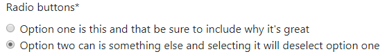

# FormHelper

Что такое **FormHelper** и как его использовать, подробно описано в предыдущем разделе [тега `` с формами](teg-crispy-s-formami.md).

## FormHelper с прикрепленной формой (макет по умолчанию)

Начиная с версии `1.2.0` **FormHelper** опционально может передаваться экземпляр формы. Вы бы сделали это так:

```python
from crispy_forms.helper import FormHelper

class ExampleForm(forms.Form):
    def __init__(self, *args, **kwargs):
        super().__init__(*args, **kwargs)
        self.helper = FormHelper(self)
```

Когда вы это сделаете, **crispy-forms** создаст для вас макет по умолчанию, используя **form.fields**, поэтому вам не нужно вручную перечислять их все, если ваша форма огромна. Если позже вам понадобится манипулировать некоторыми фрагментами большого макета, настоятельно рекомендуется использовать _динамические макеты_, установите флажок [Обновление макетов на ходу](https://django-crispy-forms.readthedocs.io/en/latest/dynamic\_layouts.html#dynamic-layouts).

Кроме того, теперь помощник может сопоставлять макет с экземпляром формы, имея возможность искать по типу виджета, если вы используете динамический API.

## Вспомогательные атрибуты helper, которые вы можете установить

### template\_pack

Позволяет вам установить, какой пакет шаблонов вы хотите использовать на уровне **FormHelper**. Это полезно, например, когда веб-сайту необходимо отображать разные формы стилей для разных вариантов использования, например веб-сайт для настольных компьютеров и веб-сайт для смартфонов.

### template

При установке позволяет отображать форму/набор форм с использованием пользовательского шаблона. Шаблон по умолчанию находится в `{{ TEMPLATE_PACK }}/[whole_uni_form.html|whole_uni_formset.html]`.

### field\_template

При установке позволяет отображать форму/набор форм с использованием настраиваемого шаблона поля. Шаблон по умолчанию находится в `{{ TEMPLATE_PACK }}/field.html`.

### form\_method = "POST"

Задает атрибут метода формы. Вы можете увидеть его в **POST** или **GET**. По умолчанию используется **POST**.

### form\_action

Применяется к атрибуту **action** формы. Может быть именованным URL-адресом в вашей конфигурации URL-адресов, который может быть выполнен с помощью тега шаблона ``. Пример: `«show_my_profile»`. В вашем **URLconf** у вас может быть что-то вроде:

```python
url(r'^show/profile/$', 'show_my_profile_view', name='show_my_profile')
```

Вы также можете указать URL-адрес `‘/whatever/blabla/’`.

Иногда вам может понадобиться добавить аргументы к URL-адресу, для этого вам нужно будет сделать это в своем представлении:

```python
from django.urls import reverse
form.helper.form_action = reverse('url_name', args=[event.id])
form.helper.form_action = reverse('url_name', kwargs={'book_id': book.id})
```

### attrs

В версии **1.2.0** добавлен словарь для установки любых атрибутов формы. Подчеркивания в ключах переводятся в дефисы. Рекомендуемый способ, когда вам нужно установить несколько атрибутов формы, чтобы ваш помощник был аккуратным:

```html
``{'id': 'form-id', 'data_id': '/whatever'}``
<form id="form-id" data-id="/whatever" ...>
```

### form\_id

Указывает атрибут идентификатора DOM формы. Если идентификатор не указан, то в форме не создается атрибут идентификатора.

### form\_class

Строка, содержащая отдельные классы CSS, применяемые для формирования атрибута класса.

### form\_tag = True

Он указывает, должны ли теги `<form></form>` отображаться при использовании макета. Если установлено значение `False`, форма отображается без тегов `<form></form>`. По умолчанию `True`.

### disable\_csrf = False

Отключает токен **CSRF**, когда это будет сделано, **cripsy-forms** не будут использовать тег ``. Это полезно при рендеринге нескольких форм с использованием тега ``, а `form_tag = False` **csrf\_token** рендерится несколько раз.

### form\_error\_title

Если вы визуализируете форму с помощью тега `` и в ней есть ошибки **non\_field\_errors** для отображения, они отображаются в **div**. Вы можете установить заголовок **div** с помощью этого атрибута. Пример: `«Form Errors»`.

### formset\_error\_title

Если вы визуализируете набор форм с помощью тега `` и у него есть **non\_form\_errors** для отображения, они отображаются в **div**. Вы можете установить заголовок **div** с помощью этого атрибута. Пример: `«Formset Errors»`.

### form\_show\_errors = True

По умолчанию установлено значение `True`. Он решает, отображать или нет ошибки формы. Если установлено значение `False`, **form.errors** не будут видны, даже если они произойдут. Вы должны вручную визуализировать их, настраивая свой шаблон. Это позволяет настроить вывод ошибок.

### render\_unmentioned\_fields = False

По умолчанию **django-crispy-forms** отображает указанный макет, если он существует строго, что означает, что он отображает только то, что упоминается в макете, если только ваша форма не имеет определенных полей **Meta.fields** и **Meta.exclude**, в этом случае она их использует. Если вы хотите отобразить неупомянутые поля (все поля формы), например, если вы беспокоитесь о том, чтобы не упомянуть их, вы должны установить для этого свойства значение `True`. По умолчанию оно равно `False`.

### render\_hidden\_fields = False

По умолчанию **django-crispy-forms** отображает указанный макет, если он существует строго. Иногда вам может быть интересно отобразить все скрытые **hidden** поля формы, независимо от того, упоминаются они или нет. Полезно при попытке отобразить формы с макетами как часть набора форм со скрытыми полями первичного ключа. По умолчанию оно равно `False`.

### render\_required\_fields = False

По умолчанию **django-crispy-forms** отображает указанный макет, если он существует строго. Иногда вас может заинтересовать отображение всех обязательных полей **required** формы независимо от того, упоминаются они или нет. По умолчанию оно равно `False`.

### include\_media = True

По умолчанию **django-crispy-forms** отображает все медиафайлы формы для вас в форме. Если вы хотите вручную визуализировать носитель формы вне формы, установите для этого параметра значение `False`. Если вы хотите глобально запретить отрисовку носителя формы, переопределите класс **FormHelper**, изменив этот параметр. По умолчанию оно равно `True`.

## Атрибуты Bootstrap помощника helper

В настоящее время есть некоторые вспомогательные атрибуты, которые имеют функциональность только для определенного пакета шаблонов. Это не обязательно означает, что они не будут поддерживаться другими пакетами шаблонов в будущем.

### help\_text\_inline = False

Устанавливает, должны ли тексты справки отображаться встроенными или блочными. Если установлено значение `True`, тексты справки будут отображаться с использованием класса **help-inline**, в противном случае — с помощью **help-block**. По умолчанию текстовые сообщения отображаются в блочном режиме.

### error\_text\_inline = True

Устанавливает, отображать ли сообщения об ошибках встроенными или блочными. Если установлено значение `True`, ошибки будут отображаться с использованием класса **help-inline**, в противном случае — с помощью **help-block**. По умолчанию сообщения об ошибках отображаются в строчном режиме.

### form\_show\_labels = True

По умолчанию установлено значение `True`. Определяет, отображать ли метки полей формы.

## Атрибуты Bootstrap 3 помощника helper

Все предыдущие атрибуты **bootstrap** (версия 2) также можно установить в пакете шаблонов bootstrap 3 **FormHelpers**. Здесь перечислены те, которые доступны только в пакете шаблонов **bootstrap3**:

### label\_class = ''

По умолчанию установлено значение `''`. Этот класс будет применяться к каждой метке, это очень полезно для создания горизонтальных форм. Установите его, например, так: `label_class = col-lg-2`.

### field\_class = ''

По умолчанию установлено значение `''`. Этот класс будет применяться к каждому элементу **controls** тега **div**, обертывающему поле. Это полезно для создания горизонтальных форм. Установите его, например, так: `field_class = col-lg-8`.

## Атрибуты Bootstrap 4 помощника helper

Все предыдущие атрибуты **bootstrap** (версии 2 и 3) также можно установить в пакете шаблонов bootstrap 4 **FormHelpers**. Здесь перечислены те, которые доступны только в пакете шаблонов **bootstrap4**:

### use\_custom\_control = True

Включает дополнительную настройку пользовательского интерфейса пакета шаблонов для переключателя **radio**, флажка **checkbox**, выбора **select** и поля файла **file**. Полезно, когда у вас уже есть настройка, основанная на интерпретации пакета шаблонов по умолчанию. Установка значения `False` приводит к тому, что [стандартные классы](https://getbootstrap.com/docs/4.3/components/forms/#checkboxes-and-radios) начальной загрузки применяются для переключателя и флажка, а также для рендеринга Django для поля файла. См. примеры в таблице ниже.

Поле файла требует [дополнительного JS](https://www.w3schools.com/bootstrap4/bootstrap\_forms\_custom.asp#myFile) для включения своей функциональности, оно предоставляется в пакете шаблонов как **vanilla JS**.

По умолчанию `True`.

|                                       |                                               |
| ------------------------------------- | --------------------------------------------- |
|  |  |
|                                       |                                               |
|                                       |                                               |

## Пользовательские вспомогательные атрибуты
