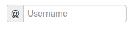

# Layouts (макеты)

## Основы

**Django-crispy-forms** определяет еще один мощный класс под названием **Layout**, который позволяет вам изменять способ отображения полей формы. Это позволяет вам устанавливать порядок полей, заключать их в **div** или другие структуры, добавлять **html**, устанавливать идентификаторы **id**, классы **class** или атрибуты на все, что вы хотите, и т. д. И все это без написания собственного шаблона формы, используя программные макеты. Просто прикрепите макет к помощнику **helper.** Макеты необязательны, но, вероятно, это самая мощная вещь, которую может предложить **django-crispy-forms**.

Макет **layout** создается объектами макета, которые можно рассматривать как компоненты формы.

Все эти компоненты объясняются позже в [универсальных объектах макета](layouts-makety.md#obekty-universalnogo-maketa), сейчас вам нужно знать о них то, что каждый компонент отображает другой шаблон и имеет другое назначение. Давайте напишем пару разных макетов для нашей формы, продолжая наш пример с классом формы (обратите внимание, что полная форма больше не показана).

Давайте добавим **layout** в наш помощник:

```python
from crispy_forms.helper import FormHelper
from crispy_forms.layout import Layout, Fieldset, Submit

class ExampleForm(forms.Form):
    [...]
    def __init__(self, *args, **kwargs):
        super().__init__(*args, **kwargs)
        self.helper = FormHelper()
        self.helper.layout = Layout(
            Fieldset(
                'first arg is the legend of the fieldset',
                'like_website',
                'favorite_number',
                'favorite_color',
                'favorite_food',
                'notes'
            ),
            Submit('submit', 'Submit', css_class='button white'),
        )
```

Когда мы визуализируем форму, используя:

```django




```

Мы получим поля, обернутые в набор полей, легенда которого будет установлена ​​на `«first arg is the legend of the fieldset»`. Порядок полей (из ранее созданной формы) будет следующим: **like\_website**, **favorite\_number**, **favorite\_color**, **favorite\_food** и **notes**. Мы также получаем кнопку отправки **Submit**, которая будет стилизована под классы Bootstrap `btn btn-primary`.

Это только вершина айсберга: теперь представьте, что вы хотите добавить объяснение того, что такое заметки, вы можете использовать объект макета **HTML**:

```python
Layout(
    Fieldset(
        'Tell us your favorite stuff {{ username }}',
        'like_website',
        'favorite_number',
        'favorite_color',
        'favorite_food',
        HTML("""
            <p>We use notes to get better, <strong>please help us {{ username }}</strong></p>
        """),
        'notes'
    )
)
```

Как вы заметите, легенда набора полей является _**контекстно-зависимой**_, и вы можете написать ее, как если бы она была фрагментом шаблона, в котором будет отображаться форма. Объект **HTML** добавит сообщение перед вводом заметок, а также контекстно-зависимый. Обратите внимание, как вы можете обернуть объекты макета в другие объекты макета. Объекты макета **Fieldset**, **Div**, **MultiField** и **ButtonHolder** могут содержать внутри себя другие объекты макета. Сделаем альтернативный макет для той же формы:

```python
Layout(
    MultiField(
        'Tell us your favorite stuff {{ username }}',
        Div(
            'like_website',
            'favorite_number',
            css_id = 'special-fields'
        ),
        'favorite_color',
        'favorite_food',
        'notes'
    )
)
```

На этот раз мы используем **MultiField**, объект макета, который, как правило, может использоваться в тех же местах, что и **Fieldset**. Основное отличие состоит в том, что при этом все поля отображаются в **div**, а когда при отправке формы есть ошибки, они отображаются в списке, а не по каждому полю, окружающему поле. Иногда лучший способ увидеть, что делают объекты макета, — это просто попробовать их и немного поиграть с ними.

## Атрибуты объектов макета

Для всех объектов макета вы можете установить **kwargs**, которые будут использоваться в качестве атрибутов **HTML**. Например, если вы хотите отключить автозаполнение для поля, вы можете сделать следующее:

```python
Field('field_name', autocomplete='off')
```

Если вы хотите установить атрибуты html со словами, разделенными дефисами, такими как **data-name**, поскольку Python не поддерживает дефисы в аргументах ключевых слов, а дефисы являются обычной записью в HTML, символы подчеркивания будут переведены в дефисы, поэтому вы должны сделать:

```python
Field('field_name', data_name="whatever")
```

Поскольку **class** является зарезервированным ключевым словом в Python, для него вам придется использовать **css\_class**. Например:

```python
Field('field_name', css_class="black-fields")
```

И атрибут **id** устанавливается с помощью **css\_id**:

```python
Field('field_name', css_id="custom_field_id")
```

## Объекты универсального макета

Они находятся в модуле **crispy\_forms.layout**. Это объекты макета, не относящиеся к пакету шаблонов. Мы пройдем по одному за другим, показывая примеры использования:

### Div

Оборачивает поля в тег `<div>`:

```python
Div('form_field_1', 'form_field_2', 'form_field_3', ...)
```


В основном во всех объектах макета вы можете установить **kwargs**, которые будут использоваться в качестве атрибутов HTML. Поскольку **class** является зарезервированным ключевым словом в Python, для него вам придется использовать **css\_class**. Например:

```python
Div(
    'form_field_1',
    style="background: white;",
    title="Explication title",
    css_class="bigdivs"
)
```


### HTML

Очень мощный объект макета. Используйте его для рендеринга чистого HTML-кода. Фактически он ведет себя как шаблон Django и имеет доступ ко всему контексту страницы, на которой отображается форма. Этот объект макета не принимает никаких дополнительных параметров, кроме **html** для рендеринга, вы не можете установить атрибуты html, как в **Div**:

```python
HTML("
 <p>Operation was successful</p> 
")
```


Помните, что это отображается в отдельном шаблоне, поэтому, если вы используете пользовательские теги шаблона или фильтры, не забудьте добавить свои ``


### Field

Чрезвычайно полезный объект макета. Вы можете использовать его для установки атрибутов в поле или отображения определенного поля с помощью настраиваемого шаблона. Таким образом вам не придется явно переопределять виджет поля и передавать уродливый словарь **attrs**:

```python
Field('password', id="password-field", css_class="passwordfields", title="Explanation")
Field('slider', template="custom-slider.html")
```

Этот объект макета можно использовать для простого расширения виджетов Django. Если вы хотите отобразить поле формы Django как _**скрытое**_, вы можете просто сделать:

```python
Field('field_name', type="hidden")
```

Если вам нужны атрибуты HTML5, вы можете легко сделать те, которые используют символы подчеркивания, **data\_name** kwarg здесь превратится в **data-name** в сгенерированном html:

```python
Field('field_name', data_name="special")
```

Поля в начальной загрузке заключены в `<div class="control-group">`. Вы можете установить дополнительные классы в этом **div**, для этого выполните:

```python
Field('field_name', wrapper_class="extra-class")
```

### Submit

Используется для создания кнопки отправки. Первый параметр — это атрибут **name** кнопки, второй параметр — это атрибут **value**:

```python
Submit('search', 'SEARCH')
```

Отображает в:

```html
<input type="submit" name="search" value="SEARCH" class="submit submitButton" id="submit-id-search" />
```

### Hidden

Используется для создания скрытого ввода:

```python
Hidden('name', 'value')
```

### Button

Создает кнопку:

```python
Button('name', 'value')
```

### Reset

Используется для создания ввода сброса:

```python
reset = Reset('name', 'value')
```

### Fieldset

Он оборачивает поля в `<fieldset>`. Первый параметр — это текст для легенды набора полей, как мы уже говорили, он ведет себя как шаблон Django:

```python
Fieldset("Text for the legend {{ username }}",
    'form_field_1',
    'form_field_2'
)
```

### ButtonHolder

Он оборачивает поля в `<div class="buttonHolder">`, это устаревший объект макета из пакета шаблонов **uni-form**:

```python
ButtonHolder(
    HTML('<span class="hidden">✓ Saved data</span>'),
    Submit('save', 'Save')
)
```

### MultiField

Он заключает поля в `<div>` с меткой label сверху. Когда в отправке формы есть ошибки, они отображаются в списке, а не в каждом поле, окружающем поле:

```python
MultiField("Text for the label {{ username }}",
    'form_field_1',
    'form_field_2'
)
```

## Объекты Bootstrap Layout

Они находятся в модуле **crispy\_forms.bootstrap**.

### FormActions

Оборачивает поля в `<div class="form-actions">`. Обычно используется для обертывания кнопок формы:

```python
FormActions(
    Submit('save', 'Save changes'),
    Button('cancel', 'Cancel')
)
```

<figure><figcaption></figcaption></figure>

### AppendedText

Отображает ввод текста с добавлением **bootstrap**. Первый параметр — это имя поля **name**, в которое добавляется дополнительный текст, затем добавленный текст, который может быть похож на HTML. Существует необязательный параметр **active**, по умолчанию установленный в `False`, который вы можете установить в логическое значение, чтобы сделать добавленный текст активным. См. [input\_size](https://django-crispy-forms.readthedocs.io/en/latest/layouts.html#input-size), чтобы изменить размер этого ввода:

```python
# Синтаксис
AppendedText('field_name', 'appended text to show')
# Пример
AppendedText('field_name', '$', active=True)
```

<figure><figcaption></figcaption></figure>

### PrependedText

Отображает ввод текста с добавлением **bootstrap**. Первый параметр — это имя поля **name**, в которое нужно добавить текст, а затем текст, который может быть похож на HTML. Существует необязательный параметр **active**, по умолчанию установленный в `False`, который вы можете установить в логическое значение, чтобы активировать предшествующий текст. См. [input\_size](https://django-crispy-forms.readthedocs.io/en/latest/layouts.html#input-size), чтобы изменить размер этого ввода:

```python
# Синтаксис
PrependedText('field_name', '<b>Prepended text</b> to show')
# Пример
PrependedText('field_name', '@', placeholder="username")
```

<figure><figcaption></figcaption></figure>

### PrependedAppendedText

Отображает комбинированный текст с добавлением спереди и сзади. Первый параметр — это имя поля **name**, затем добавляемый текст в начало и, наконец, добавляемый текст в конец. См. [input\_size](https://django-crispy-forms.readthedocs.io/en/latest/layouts.html#input-size), чтобы изменить размер этого ввода:

```python
PrependedAppendedText('field_name', '$', '.00'),
```

<figure><figcaption></figcaption></figure>

### InlineCheckboxes

Отображает поле Django **forms.MultipleChoiceField**, используя встроенные флажки:

```python
InlineCheckboxes('field_name')
```

<figure><figcaption></figcaption></figure>

### InlineRadios

Отображает поле Django **forms.ChoiceField** с его виджетом, установленным на **forms.RadioSelect**, используя встроенные переключатели:

```python
InlineRadios('field_name')
```

<figure><figcaption></figcaption></figure>

### StrictButton

Он отображает кнопку, используя html-тег `<button>`, а не ввод **input**. По умолчанию для установлен тип **type** со значением **button**, а для класса **class** установлено значение **btn**:

```python
StrictButton("Button's content", name="go", value="go", css_class="extra")
StrictButton('Success', css_class="btn-success")
```

<figure><figcaption></figcaption></figure>

### FieldWithButton

Вы можете создать ввод, связанный с кнопками:

```
# Размер поля можно настроить в пакете шаблонов Bootstrap4,
# передав класс модификатора размера в input_size.

FieldWithButtons('field_name', StrictButton("Go!"), input_size="input-group-sm")
```

<figure><figcaption></figcaption></figure>

### Tab & TabHolder

**Tab** отображает вкладку, разные вкладки должны быть обернуты в **TabHolder** для автоматического функционирования JavaScript, также вам понадобится **bootstrap-tab.js**, включенный в ваши статические файлы:

```python
TabHolder(
    Tab('First Tab',
        'field_name_1',
        Div('field_name_2')
    ),
    Tab('Second Tab',
        Field('field_name_3', css_class="extra")
    )
)
```

<figure><figcaption></figcaption></figure>

### Accordion & AccordionGroup

**AccordionGroup** отображает панель аккордеона, различные группы должны быть заключены в **Accordeon** для автоматического функционирования JavaScript, также вам понадобится **bootstrap-tab.js**, включенный в ваши статические файлы:

```python
Accordion(
    AccordionGroup('First Group',
        'radio_buttons'
    ),
    AccordionGroup('Second Group',
        Field('field_name_3', css_class="extra")
    )
)
```

<figure><figcaption></figcaption></figure>

### Alert

**Alert** генерирует разметку в виде диалогового окна предупреждения:

```python
Alert(
    content="<strong>Warning!</strong> Best check yo self, you're not looking too good."
)
```

<figure><figcaption></figcaption></figure>

### UneditableField

**UneditableField** отображает отключенное поле, используя класс **uneditable-input** начальной загрузки:

```python
UneditableField('text_input', css_class='form-control-lg')
```

<figure><figcaption></figcaption></figure>

### Modal

**Modal** отображает свои поля внутри модального окна начальной загрузки, которое можно настроить с помощью **kwargs** при инициализации. См. документы bootstrap для получения дополнительных примеров модальных окон и того, как управлять вашим модальным окном [с помощью атрибутов](https://getbootstrap.com/docs/4.0/components/modal/#via-data-attributes) или [с помощью javascript](https://getbootstrap.com/docs/4.0/components/modal/#via-javascript). Поддерживает только **Bootstrap v3** или выше:

```python
Layout(
    Modal(
        # email.help_text был установлен во время инициализации поля формы django
        Field('email', placeholder="Email", wrapper_class="mb-0"),
        Button(
            "submit",
            "Send Reset Email",
            id="email_reset",
            css_class="btn-primary mt-3",
            onClick="someJavasciptFunction()", # используется для отправки формы
        ),
        css_id="my_modal_id",
        title="This is my modal",
        title_class="w-100 text-center",
    )
)
```

<figure><figcaption></figcaption></figure>

### Размер группы input

По умолчанию используются стандартные размеры ввода **Bootstrap**. Чтобы настроить размер группы ввода (**AppendedText**, **PrependedText**, **PrependedAppendedText**), добавьте соответствующий класс CSS:

```python
# Bootstrap 3 - Входы (input) и интервалы (span) требуют класса размера.
# Используйте `css_class`.
PrependedText('field_name', StrictButton("Go!"), css_class="input-sm")
PrependedText('field_name', StrictButton("Go!"), css_class="input-lg")

# Bootstrap 4 - Обертка div требует класса размера. Используйте `input_size`.
PrependedText('field_name', StrictButton("Go!"), input_size="input-group-sm")
PrependedText('field_name', StrictButton("Go!"), input_size="input-group-lg")
```

## Переопределение шаблонов объектов макета

## Переопределение шаблонов проектов

## Создание собственных объектов макета

## Составление макетов
