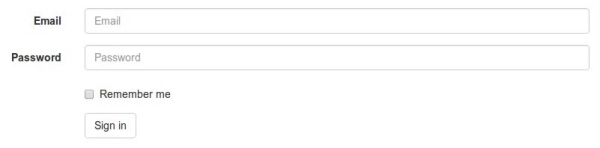
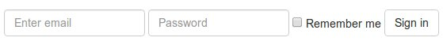

# Тег \{% crispy %\} с формами

**django-crispy-forms** реализует класс **FormHelper**, который определяет поведение рендеринга формы. Помощники (helpers) дают вам возможность управлять атрибутами формы и ее макетом, делая это программным способом с использованием Python. Таким образом, вы пишете как можно меньше HTML, а вся ваша логика остается в файлах форм и представлений.

## Основы

В оставшейся части этого документа мы будем использовать следующий пример формы, показывающий, как использовать помощника **helper**. Эта форма отвечает за сбор некоторой информации о пользователе:

```python
class ExampleForm(forms.Form):
    like_website = forms.TypedChoiceField(
        label = "Do you like this website?",
        choices = ((1, "Yes"), (0, "No")),
        coerce = lambda x: bool(int(x)),
        widget = forms.RadioSelect,
        initial = '1',
        required = True,
    )

    favorite_food = forms.CharField(
        label = "What is your favorite food?",
        max_length = 80,
        required = True,
    )

    favorite_color = forms.CharField(
        label = "What is your favorite color?",
        max_length = 80,
        required = True,
    )

    favorite_number = forms.IntegerField(
        label = "Favorite number",
        required = False,
    )

    notes = forms.CharField(
        label = "Additional notes or feedback",
        required = False,
    )
```

Давайте посмотрим, как работают помощники, шаг за шагом, с объяснением некоторых примеров. Сначала вам нужно будет импортировать **FormHelper**:

```python
from crispy_forms.helper import FormHelper
```

Вашим помощником (helper) может быть переменная уровня класса или переменная уровня экземпляра, если вы не знаете, что это значит, вы можете прочитать статью «[Будьте осторожны при использовании статических переменных в формах](https://tothinkornottothink.com/post/7157151391/be-careful-how-you-use-static-variables-in-forms)». Как правило, если вы не собираетесь манипулировать **FormHelper** в своем коде, например, в представлении, вам следует использовать _статический помощник_, в противном случае вам следует использовать _помощник уровня экземпляра_. Если вы все еще не понимаете тонкие различия между ними, используйте помощник уровня экземпляра, потому что вы не столкнетесь с побочными эффектами. Как и в следующих шагах, я покажу вам, как манипулировать хелпером формы, поэтому мы создадим хелпер уровня экземпляра. Вот как вы это сделаете:

```python
from crispy_forms.helper import FormHelper

class ExampleForm(forms.Form):
    [...]
    def __init__(self, *args, **kwargs):
        super().__init__(*args, **kwargs)
        self.helper = FormHelper()
```

Как видите, вам нужно вызвать конструктор базового класса с помощью **super** и переопределить конструктор. Этот помощник не устанавливает никаких атрибутов формы, поэтому он бесполезен. Давайте посмотрим, как настроить некоторые основные атрибуты **FormHelper**:

```python
from crispy_forms.helper import FormHelper
from crispy_forms.layout import Submit

class ExampleForm(forms.Form):
    [...]
    def __init__(self, *args, **kwargs):
        super().__init__(*args, **kwargs)
        self.helper = FormHelper()
        self.helper.form_id = 'id-exampleForm'
        self.helper.form_class = 'blueForms'
        self.helper.form_method = 'post'
        self.helper.form_action = 'submit_survey'

        self.helper.add_input(Submit('submit', 'Submit'))
```

Обратите внимание, что мы импортируем класс **Submit**, который является объектом макета (layout). Позже мы подробно увидим, что представляют собой объекты макета, а сейчас просто скажем, что это добавляет кнопку отправки в нашу форму, чтобы люди могли отправить свой опрос.

Мы также использовали вспомогательную магию. **FormHelper** имеет список атрибутов, которые можно установить, которые _влияют в основном на атрибуты формы_. Наша форма будет иметь <mark style="color:orange;">идентификатор DOM</mark> **id-exampleForm**, она будет иметь <mark style="color:orange;">класс DOM CSS</mark> **blueForms**, она будет использовать <mark style="color:orange;">http POST</mark> для отправки информации, и ее <mark style="color:orange;">действие action</mark> будет установлено на `reverse(submit_survey)`.

Давайте посмотрим, как отобразить форму в шаблоне. Предположим, что у нас есть форма в контексте шаблона как **example\_form**, мы бы отрендерили ее следующим образом:

```django




```

Обратите внимание, что теги `` ожидают _**два параметра**_: сначала _переменную формы_, а затем _вспомогательную функцию_. В этом случае мы используем **FormHelper**, прикрепленный к форме, но вы также можете создать экземпляр **FormHelper** и передать его как контекстную переменную. В большинстве случаев вы захотите использовать _прикрепленный помощник_. Обратите внимание, что если вы назовете свой помощник helper'ом как атрибут **FormHelper**, вам нужно будет сделать только:

```django



```

С пакетом шаблонов **Bootstrap 4** по умолчанию это именно этот **html**, который вы получите:

```html
<form action="submit_survey" class="blueForms" id="id-exampleForm" method="post">
    <input name="csrfmiddlewaretoken" type="hidden" value="evU93ufHyzX5dP5h5hgOaq96zIj8c02X">
    <div id="div_id_like_website" class="form-group">
        <label class="requiredField"> Do you like this website?<span class="asteriskField">*</span> </label>
        <div action="submit_survey" class="blueForms" id="id-exampleForm">
            <div class="custom-control custom-radio">
                <input type="radio" class="custom-control-input" name="like_website" value="1" id="id_like_website_0" required checked /> <label class="custom-control-label" for="id_like_website_0"> Yes </label>
            </div>
            <div class="custom-control custom-radio">
                <input type="radio" class="custom-control-input" name="like_website" value="0" id="id_like_website_1" required /> <label class="custom-control-label" for="id_like_website_1"> No </label>
            </div>
        </div>
    </div>
    <div id="div_id_favorite_food" class="form-group">
        <label for="id_favorite_food" class="requiredField"> What is your favorite food?<span class="asteriskField">*</span> </label>
        <div><input type="text" name="favorite_food" maxlength="80" class="textinput inputtext form-control" required id="id_favorite_food" /></div>
    </div>
    <div id="div_id_favorite_color" class="form-group">
        <label for="id_favorite_color" class="requiredField"> What is your favorite color?<span class="asteriskField">*</span> </label>
        <div><input type="text" name="favorite_color" maxlength="80" class="textinput inputtext form-control" required id="id_favorite_color" /></div>
    </div>
    <div id="div_id_favorite_number" class="form-group">
        <label for="id_favorite_number" class=""> Favorite number </label>
        <div><input type="number" name="favorite_number" class="numberinput form-control" id="id_favorite_number" /></div>
    </div>
    <div id="div_id_notes" class="form-group">
        <label for="id_notes" class=""> Additional notes or feedback </label>
        <div><input type="text" name="notes" class="textinput inputtext form-control" id="id_notes" /></div>
    </div>
    <div class="form-group">
        <div class=""><input type="submit" name="submit" value="Submit" class="btn btn-primary" id="submit-id-submit" /></div>
    </div>
</form>
```

То, что вы получите, — это форма, представленная в виде HTML с потрясающими битами. Конкретно…

Открытие и закрытие тегов формы с идентификатором, классом, действием и методом, установленными как в помощнике:

```html
<form action="submit_survey" class="blueForms" id="id-exampleForm" method="post">
    [...]
</form>
```

CSRF Django контроль:

```html
<input name="csrfmiddlewaretoken" type="hidden" value="evU93ufHyzX5dP5h5hgOaq96zIj8c02X">
```

Кнопка отправки:

```html
<div class="form-group">
    <div class=""><input type="submit" name="submit" value="Submit" class="btn btn-primary" id="submit-id-submit" /></div>
</div>
```

## Управление помощником helper в представлении view

Давайте посмотрим, как мы можем изменить любое вспомогательное свойство в представлении:

```python
@login_required()
def inbox(request, template_name):
    example_form = ExampleForm()
    redirect_url = request.GET.get('next')

    # Логика работы с формой
    [...]

    if redirect_url is not None:
        example_form.helper.form_action = reverse('submit_survey') + '?next=' + redirectUrl

    return render_to_response(
        template_name,
        {'example_form': example_form},
        context_instance=RequestContext(request)
    )
```

Мы меняем вспомогательное свойство **form\_action** на случай, если представление было вызвано со параметром GET **next**.

## Отрисовка нескольких форм с хелперами

Часто нас спрашивают: «Как сделать рендеринг двух или более форм с соответствующими хелперами, используя тег ``, без двойного рендеринга `<form>` тегов?» Легко, вам нужно установить свойство помощника **form\_tag** в `False` в каждом помощнике:

```python
self.helper.form_tag = False
```

Затем вам нужно будет написать небольшой html-код, окружающий формы:

```django
<form action="
" class="my-class" method="post">
    
    

</form>
```

Вы можете прочитать [список атрибутов помощника, которые вы можете установить](https://django-crispy-forms.readthedocs.io/en/latest/form\_helper.html#helper-attributes), и для чего они нужны.

## Измените `«*»` обязательные поля

Если вам не нравится использование `'*'` (звездочка) для обозначения обязательных полей, у вас есть два варианта:

Звездочки имеют набор классов **asteriskField**. Таким образом, вы можете скрыть его с помощью правила CSS:

```css
.asteriskField {
    display: none;
}
```

Или замените шаблон `field.html` на собственный.

## Сделайте так, чтобы crispy формы терпели неудачу громко

По умолчанию, когда **crispy-forms** обнаруживает ошибки, он молча завершает работу, регистрирует их и продолжает работать, если это возможно. Была добавлена переменная настроек под названием **CRISPY\_FAIL\_SILENTLY**, чтобы вы могли контролировать это поведение. Если вы хотите создавать исключения вместо ведения журнала, сообщая вам, что происходит, когда вы разрабатываете в режиме отладки, вы можете установить для него значение:

```python
CRISPY_FAIL_SILENTLY = not DEBUG
```

## Изменить `<input>` классы по умолчанию для crispy-forms

Поля Django генерируют классы по умолчанию, **crispy-forms** обрабатывает их и добавляет другие классы для совместимости с фреймворками CSS.

Например, **CharField** генерирует `<input class="textinput" ...`. Но в форме **uni** нам нужно, чтобы класс был **textInput** (с заглавной `"I"`), поэтому **crispy-forms** оставляет его как `<input class="textinput textInput" ...`. Все официальные пакеты шаблонов обрабатываются автоматически, но, возможно, вы интегрируете новую структуру CSS или собственную структуру вашей компании с четкими формами и вам нужно изменить преобразования по умолчанию. Для этого вам нужно использовать переменную настроек с именем **CRISPY\_CLASS\_CONVERTERS**, которая должна быть _словарем Python_:

```python
CRISPY_CLASS_CONVERTERS = {'textinput': "textinput inputtext"}
```

Например, этот параметр будет генерировать `<input class"textinput inputtext" ...`. Ключ словаря **textinput** - это класс Django по умолчанию, значение - это то, на что вы хотите его заменить, в этом случае мы сохраняем **textinput**.

## Рендеринг формы в коде Python

Иногда может быть полезно отобразить форму, используя **crispy-forms** в коде Python, например представление Django, для этого есть хороший помощник **render\_crispy\_form**. Прототипом метода является `render_crispy_form(form, helper=None, context=None)`. Вы можете использовать это так. Не забудьте передать свой токен **CSRF** вспомогательному методу, используя словарь контекста, если вы хотите, чтобы визуализированная форма могла быть отправлена.

## Рецепт проверки AJAX

Вы можете проверить **crispy-forms** с помощью **AJAX**, чтобы повторно отобразить любые возникающие ошибки формы. Один из способов сделать это — настроить представление, которое проверяет форму и отображает ее html с помощью **render\_crispy\_form**. Затем этот HTML-код возвращается в клиентский AJAX-запрос. Давайте посмотрим пример.

Наш код на стороне сервера может быть:

```python
from django.template.context_processors import csrf
from crispy_forms.utils import render_crispy_form

@json_view
def save_example_form(request):
    form = ExampleForm(request.POST or None)
    if form.is_valid():
        # На самом деле вы можете сохранить через AJAX и вернуть код успеха здесь
        form.save()
        return {'success': True}

    ctx = {}
    ctx.update(csrf(request))
    form_html = render_crispy_form(form, context=ctx)
    return {'success': False, 'form_html': form_html}
```

Я использую декоратор **jsonview** от [django-jsonview](https://github.com/jsocol/django-jsonview).

Обратите внимание, что вы должны предоставить **render\_crispy\_form** необходимый **токен CSRF**, иначе он не будет работать.

В нашей клиентской части использование **jQuery** будет выглядеть так:

```javascript
var example_form = '#example-form';

$.ajax({
    url: "

",
    type: "POST",
    data: $(example_form).serialize(),
    success: function(data) {
        if (!(data['success'])) {
            // Здесь мы заменяем форму на
            $(example_form).replaceWith(data['form_html']);
        }
        else {
            // Здесь вы можете показать пользователю сообщение об успехе
            // или сделать все, что вам нужно.
            $(example_form).find('.success-message').show();
        }
    },
    error: function () {
        $(example_form).find('.error-message').show()
    }
});
```


При замене html формы вам необходимо привязать события, используя метод **live** или **on** jQuery.


## Bootstrap горизонтальные формы

<figure><figcaption></figcaption></figure>

То, как вы делаете горизонтальные формы в **Bootstrap** версии **3**, устанавливает некоторые классы **col-lg-X** в метках и полях упаковки **div**. Это означало бы много хлопот при обновлении объектов макета (layout) для настроек этих классов, слишком много детализации. Вместо этого были добавлены некоторые атрибуты **FormHelper**, которые помогут вам легко достичь этого. Вам нужно будет установить только три атрибута:

```python
helper.form_class = 'form-horizontal'
helper.label_class = 'col-lg-2'
helper.field_class = 'col-lg-8'
helper.layout = Layout(
    'email',
    'password',
    'remember_me',
    StrictButton('Sign in', css_class='btn-default'),
)
```

Конечно, вы можете установить ширину по своему усмотрению, она не обязательно должна быть именно такой.

## Встроенные формы Bootstrap

<figure><figcaption></figcaption></figure>

Как вы делаете встроенные формы в **Bootstrap** версии **3**:

```python
helper.form_class = 'form-inline'
helper.field_template = 'bootstrap3/layout/inline_field.html'
helper.layout = Layout(
    'email',
    'password',
    'remember_me',
    StrictButton('Sign in', css_class='btn-default'),
)
```


Класс **form-inline** необходимо добавить в тег `<form>` формы. Поэтому позвольте **crispy-forms** отображать тег `<form>` или добавьте класс **form-inline** вручную к тегу `<form>` в вашем шаблоне.


Если вам нужно установить атрибуты в поле, вы должны использовать **InlineField** вместо **Field**:

```python
from crispy_forms.bootstrap import InlineField

helper.layout = Layout(
    InlineField('email', readonly=True),
    'password',
    [...]
)
```
