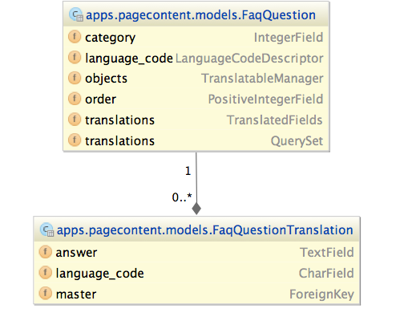
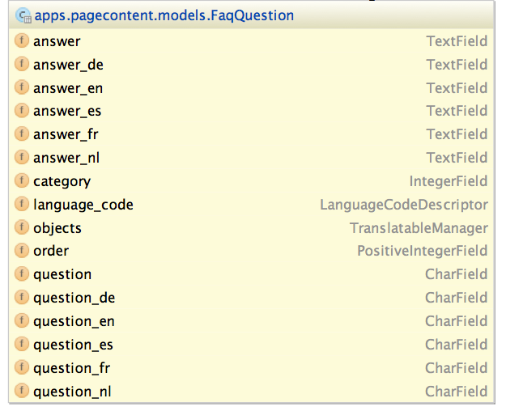

# Происхождение django-parler

## Краткая история

Этот пакет вдохновлен [django-hvad](https://github.com/kristianoellegaard/django-hvad). При попытке интегрировать многоязычную поддержку в [django-fluent-pages](https://github.com/edoburu/django-fluent-pages) с помощью **django-hvad** это оказалось очень сложно. Печальная правда заключается в том, что, хотя **django-hvad** имеет приятный интерфейс администратора, макет таблицы и API модели, он также переопределяет большую часть поведения по умолчанию для наборов запросов и метаклассов модели. Это предотвращает объединение **django-hvad**, например, с [django-polymorphic](https://github.com/django-polymorphic/django-polymorphic) или [django-mptt](https://github.com/django-mptt/django-mptt).

При исследовании других многоязычных пакетов они либо оказались устаревшими, либо хранили переводы в той же таблице (слишком негибкой для нас), либо предоставляли только модельный API. Следовательно, возникла потребность в новом решении, использующем простой, грубый, но эффективный API.

Чтобы запустить многоязычную поддержку в нашем пакете [django-fluent-pages](https://github.com/edoburu/django-fluent-pages), она была закодирована непосредственно в самом пакете. Был принят во внимание будущий переход [django-hvad](https://github.com/kristianoellegaard/django-hvad). Вместо выполнения операций с метаклассами "shared model" просто передала все атрибуты переведенной модели (все они были созданы вручную). Запросы просто нужно было выполнять с использованием `.filter(translations__title=..)`. Это оказалось разумным решением и быстро выяснилось, что этот код заслуживает отдельного пакета, да и некоторым другим модулям он тоже нужен.

Этот пакет представляет собой попытку объединить лучшее из обоих миров; простота API **django-hvad** с грубым, но эффективным решением проксирования переведенных атрибутов.

Кроме того, предоставляется API-сахар, аналогичный тому, что есть у **django-hvad**. Модель переводов можно создать вручную или позволить ей создаваться динамически при использовании поля **TranslatedFields**. Это сделано для того, чтобы облегчить вашу жизнь, не теряя при этом свободы ручного использования API по вашему желанию.

## Презентации

**django-parler** - небольшое обсуждение на DjangoCon EU 2014 [https://speakerdeck.com/vdboor/django-parler-djangocon-eu-2014-lightning-talk](https://speakerdeck.com/vdboor/django-parler-djangocon-eu-2014-lightning-talk)

## Схема базы данных

**django-parler** использует отдельную таблицу для хранения переведенных полей. В каждой строке хранится содержимое для одного языка с использованием столбца **language\_code**.

<figure><figcaption></figcaption></figure>

Тот же макет базы данных используется [django-hvad](https://github.com/kristianoellegaard/django-hvad), что делает переход к **django-parler** довольно простым.

#### Преимущества:

* Работает с существующими инструментами, такими как среда миграции Django.
* Неограниченное количество языков может поддерживаться
* Языки можно добавлять на лету, миграция базы данных не требуется.

#### Недостатки:

* Для получения переведенных полей необходим дополнительный запрос к базе данных.
* Фильтрация переведенных полей должна происходить в одном вызове `.filter(..)`.

#### Решения:

* Дополнительные запросы к базе данных в основном избегаются благодаря механизму кэширования, который может хранить переведенные поля в **memcached**.
* Чтобы запросить все языки, используйте `.prefetch('translations')` в запросе ORM. Предварительно загруженные данные будут прочитаны **django-parler**.

### Противоположный дизайн: django-modeltranslation

Классическое решение для написания переводимых полей использует [django-modeltranslation](https://github.com/deschler/django-modeltranslation). Каждое поле имеет отдельный столбец для каждого языка.

<figure><figcaption></figcaption></figure>

#### Преимущества:

* быстрое чтение всех данных, все в одной таблице.
* редактировать все поля сразу легко.

#### Недостатки:

* Схема базы данных изменяется в зависимости от настроек проекта.
* Сторонние пакеты не могут обеспечить разумную миграцию данных для переведенных полей.
* Для проектов с большим количеством языков при каждом запросе будет считываться множество дополнительных полей,

## Именование пакета

Название пакета довольно легко объяснить; «parler» по-французски означает «говорить».

А чтобы узнать о [нашем лозунге](http://urbandictionary.com/define.php?term=Omelette+du+fromage), посмотрите серию «Лаборатория Декстера» «Большой сыр». ;-)
