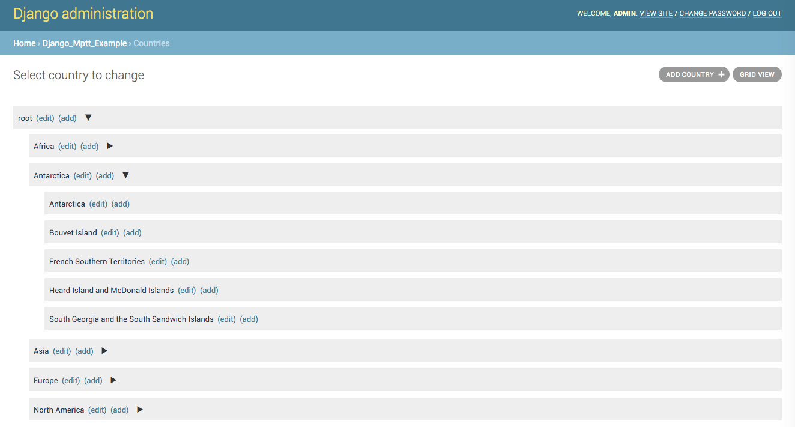

# django-mptt-admin

**Django-mptt-admin** предоставляет приятный интерфейс администрирования Django для [моделей django-mptt](https://mbraak.github.io/django-mptt-admin/).

* Исходный код доступен на [https://github.com/mbraak/django-mptt-admin](https://github.com/mbraak/django-mptt-admin).
* Документация доступна на [https://mbraak.github.io/django-mptt-admin/](https://mbraak.github.io/django-mptt-admin/).

<figure><figcaption></figcaption></figure>

## Требования

Пакет протестирован с Django (3.2, 4.0 и 4.1) и django-mptt (0.13). Также с Python 3.6–3.10.

Старые версии:

* Версия 1.0.x поддерживает Django 2.0 и 2.1.
* Версия 0.7.2 поддерживает Django 1.11 и Python 2.7.

## Установка

Установите пакет:

```bash
$ pip install django-mptt-admin
```

Добавьте **django\_mptt\_admin** к вашим установленным приложениям в **settings.py**.

```python
INSTALLED_APPS = (
    ..
    'django_mptt_admin',
)
```

Используйте класс **DjangoMpttAdmin** в **admin.py**:

```python
from django.contrib import admin
from django_mptt_admin.admin import DjangoMpttAdmin
from models import Country

class CountryAdmin(DjangoMpttAdmin):
    pass

admin.site.register(Country, CountryAdmin)
```

## Параметры

