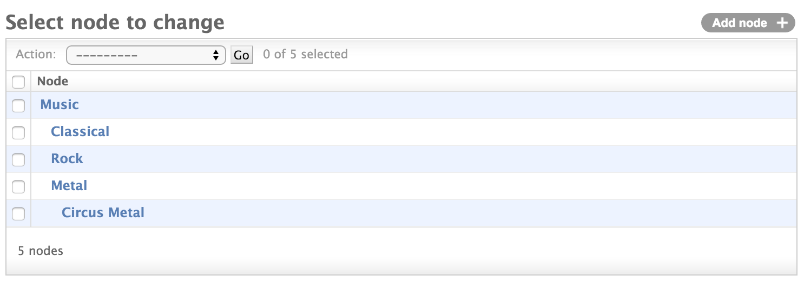
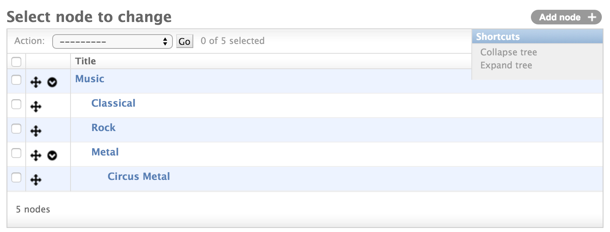
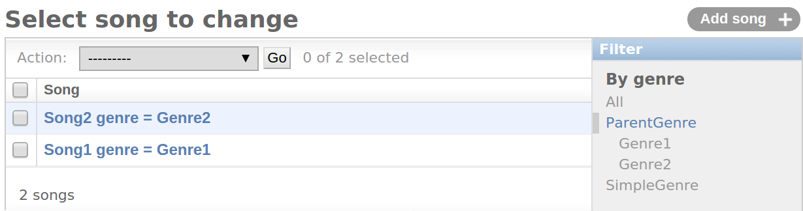

# Admin классы django-mptt

## mptt.admin.MPTTModelAdmin

Это простой вид дерева в админке. Все, что он делает, это обеспечивает упорядочение и делает отступы для узлов в дереве, чтобы создать красивое представление списка дерева.

<figure><figcaption></figcaption></figure>

Использование:

```python
from django.contrib import admin
from mptt.admin import MPTTModelAdmin
from myproject.myapp.models import Node

admin.site.register(Node, MPTTModelAdmin)
```

Вы можете глобально изменить пиксели отступа для каждого уровня, поместив это в свой `settings.py`:

```python
# по умолчанию 10 пикселей
MPTT_ADMIN_LEVEL_INDENT = 20
```

Если вы хотите указать количество пикселей для каждой модели, определите атрибут **mptt\_level\_indent** в вашем **MPTTModelAdmin**:

```python
from django.contrib import admin
from mptt.admin import MPTTModelAdmin
from myproject.myapp.models import Node

class CustomMPTTModelAdmin(MPTTModelAdmin):
    # укажите количество пикселей только для этого ModelAdmin:
    mptt_level_indent = 20

admin.site.register(Node, CustomMPTTModelAdmin)
```

Если вы хотите указать, какое поле должно иметь отступ, добавьте **mptt\_indent\_field** в свой **MPTTModelAdmin**:

```python
# …
class CustomMPTTModelAdmin(MPTTModelAdmin):
    mptt_indent_field = "some_node_field"
# …
```

## mptt.admin.DraggableMPTTAdmin

_Новое в версии 0.8.1_.

<figure><figcaption></figcaption></figure>

Это дерево админки на основе **FeinCMS**, предлагающий функцию перетаскивания для перемещения узлов:

```python
from django.contrib import admin
from mptt.admin import DraggableMPTTAdmin
from myproject.myapp.models import Node

admin.site.register(
    Node,
    DraggableMPTTAdmin,
    list_display=(
        'tree_actions',
        'indented_title',
        # ...больше полей, если хотите...
    ),
    list_display_links=(
        'indented_title',
    ),
)
```


Поддерживаемые браузеры включают все последние версии Firefox, Chrome, Safari и Internet Explorer (9 или выше).



Плохо работает с большими деревьями (более нескольких сотен узлов или деревья глубже 10 уровней). Патчи, реализующие ленивую загрузку глубоких деревьев, очень ценятся.


Рекомендуется, чтобы **tree\_actions** было первым значением, передаваемым в **list\_display**; это также требует, чтобы вы указали **list\_display\_links**, потому что **tree\_actions** нельзя использовать в качестве поля ссылки на объект.

**indented\_title** ничего не делает, кроме как возвращает самоописание узлов с отступом, 20 пикселей на уровень (или значение **mptt\_level\_indent**, см. ниже).

**list\_per\_page** по умолчанию имеет значение 2000 (что эффективно отключает нумерацию страниц для большинства деревьев).

Вы можете установить атрибут `expand_tree_by_default = True` в вашем **DraggableMPTTAdmin**, чтобы развернуть дерево при первом посещении страницы (по умолчанию `False`). После этого состояние каждого узла (развернутое или свернутое) сохраняется в хранилище браузера.

## Замена indented\_title

Если вы хотите заменить метод **indented\_title** своим, мы рекомендуем использовать следующий код:

```python
from django.utils.html import format_html

class MyDraggableMPTTAdmin(DraggableMPTTAdmin):
    list_display = ('tree_actions', 'something')
    list_display_links = ('something',)

    def something(self, instance):
        return format_html(
            '<div style="text-indent:{}px">{}</div>',
            instance._mpttfield('level') * self.mptt_level_indent,
            instance.name,  # Или что вы хотите поместить здесь
        )
    something.short_description = _('something nice')
```

Чтобы изменить отступ для каждого узла, смотрите ниже. Простой замены **indented\_title** недостаточно, потому что отступ также должен быть передан коду JavaScript.

## Переопределение шаблонов администратора для каждого приложения или модели

**DraggableMPTTAdmin** использует стандартный шаблон списка изменений администратора с некоторыми элементами CSS и JavaScript, поэтому просто следуйте официальному руководству по [переопределению шаблонов администратора](https://docs.djangoproject.com/en/2.0/ref/contrib/admin/#overriding-admin-templates).

## Изменение отступа узлов

Просто установите для **mptt\_level\_indent** другое значение в пикселях (по умолчанию **20**):

```python
# ...
class MyDraggableMPTTAdmin(DraggableMPTTAdmin):
    mptt_level_indent = 50
# ...
```

## mptt.admin.TreeRelatedFieldListFilter

Класс фильтра администратора, который фильтрует модели, связанные с родительской моделью, со всеми ее потомками.

<figure><figcaption></figcaption></figure>

Использование:

```python
from mptt.admin import TreeRelatedFieldListFilter

@admin.register(models.MyModel)
class MyModelAdmin(admin.ModelAdmin):
    model = models.MyModel
    list_filter =
    (
        ('my_related_model', TreeRelatedFieldListFilter),
    )
```

## Изменение отступа узлов фильтра списка

Просто установите для **mptt\_level\_indent** другое значение в пикселях (по умолчанию **10**):

```python
# ...
class MyTreeRelatedFieldListFilter(TreeRelatedFieldListFilter):
    mptt_level_indent = 20
# ...
```
